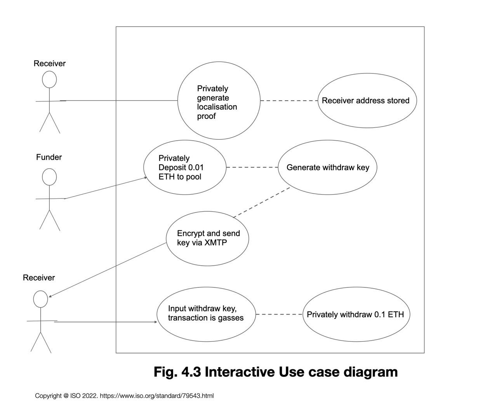

# The Private Peace Project

## Privacy-preserving emergency financing

The Private Peace Project aims to cut out the middle man and fund people who need it most. You can sign up as a receiver by proving you are part of one of the groups in need. Any identity information is only processed locally and sent as a proof. You can also sign up as a funder and send funds to any of the pools without revealing which one you are sending to. Your funds will go directly to someone in need.

## Flow



### Funder

- Generate a note commitment and send this along with 0.01 ETH to the `deposit` function
- The `deposit()` function adds a commitment to the contract's associated merkle tree
- Locally, a note is encrypted to an address related to the pool you want to contribute to. This note or pool decision is not posted on chain anywhere. The note contains proof inputs for generating an inclusion proof
- This encrypted note is sent over XMPT to a receiver in the associated pool

### Receiver
- Generate a proof that you are a member of the group you wish to be added into
- Currently, this is either Ukrainian (through their national identity app, Dia) or Palestine (passport + selfie + location)
- This information never leaves the device, so it remains private
- `addAddress()` is called with this proof as a param, which then verifies the proof on-chain and adds the address to an array of your pool. This array is public. This transaction is sponsored by a paymaster
- XMTP messages are now shown, and the receiver must wait until one is available for them
- Upon receival of a message, the content is automatically decrypted using the private key 
- These are proof inputs that are then passed into a proof, to generate a proof locally
- This proof is sent to `withdraw()` function and the 0.01ETH will be sent to the receiver's wallet. This transaction is also sponsored

## This repo

This is a monorepo containing [circuits](./circuits/), [contracts](./contracts/), an [e2e test covering both flows](./test/privatepeaceproject.test.ts), and [frontend](./client/). 

## Run the frontend

The contracts are deployed on the Sepolia testnet, and the frontend links directly to this. You do not need to compile or deploy contracts before using this.

### Prerequisites

- node
- nargo (installation instructions [here](https://noir-lang.org/docs/getting_started/installation/))

### Install packages

In the `client` directory, run:

```bash
npm i
```

### Compile circuits

In the `circuits` directory, run:

```bash
nargo compile
```

### Run

In the `client` directory, run:

```bash
npm run dev
```

## Run the tests locally

If you'd rather run tests directly against the contracts locally, follow these steps.

### Prerequisites

- hardhat

### Compile circuits

In the `circuits` directory, run:

```bash
nargo compile
```

### Compile contracts

In the root directory, run:

```bash
npx hardhat compile
```

### Run the tests

Start a hardhat node from inside the root directory: 

```bash
npx hardhat node
```

Open a new terminal and, in the root directory, run:

```bash
npx hardhat test
```

This test script deploys the contracts you have compiled.

You should see some console logging and successful testing. 

## Addresses

On Ethereum Sepolia network, the contracts are deployed at these addresses:

- Mimc merkle tree verifier deployed at [0x6892c87002e116AEC1ea8C76a792DCF112d3b93c](https://sepolia.etherscan.io/address/0x6892c87002e116AEC1ea8C76a792DCF112d3b93c)
- Palestine verifier deployed at [0x4aE653259b7fBBb2C666d77CbD6279fC3534d966](https://sepolia.etherscan.io/address/0x4aE653259b7fBBb2C666d77CbD6279fC3534d966)
- Hasher deployed at [0x0DF19cdd7634DA980033De3B5c083093595A2384](https://sepolia.etherscan.io/address/0x0DF19cdd7634DA980033De3B5c083093595A2384)
- DepositAndWithdraw deployed at [0x58D2D174483ac0b236116BD381BBcC3A5d83b457](https://sepolia.etherscan.io/address/0x58D2D174483ac0b236116BD381BBcC3A5d83b457)

